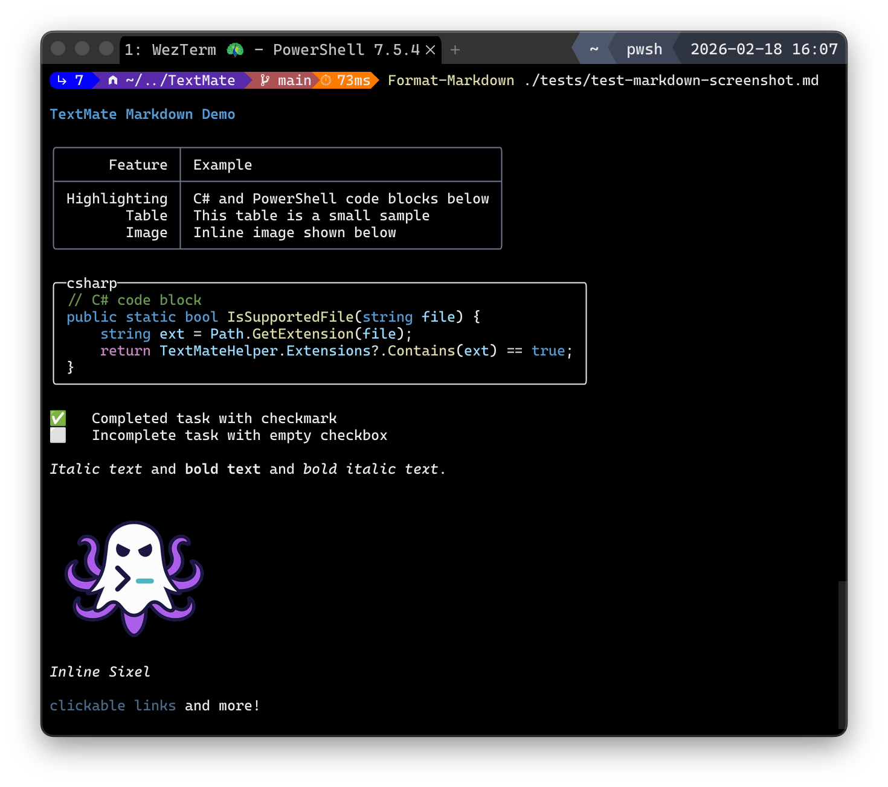

# TextMate

TextMate delivers syntax-aware highlighting for PowerShell on top of TextMate grammars. It exposes a focused set of cmdlets that emit tokenized, theme-styled `HighlightedText` renderables you can write with PwshSpectreConsole or feed into any Spectre-based pipeline. Helper cmdlets make it easy to discover grammars and validate support for files, extensions, or language IDs before formatting.

What it does

- Highlights source text using TextMate grammars such as PowerShell, C#, Markdown, and Python.
- Returns `HighlightedText` renderables that implement Spectre.Console's contract, so they can be written through PwshSpectreConsole or other Spectre hosts.
- Provides discovery and testing helpers for installed grammars, extensions, or language IDs.
- Does inline Sixel images in markdown



## Cmdlets

| Cmdlet | Purpose |
|--------|---------|
| [Format-TextMate](docs/en-us/Format-TextMate.md) | Render text with an inferred or explicit language. |
| [Format-CSharp](docs/en-us/Format-CSharp.md) | Highlight C# source |
| [Format-Markdown](docs/en-us/Format-Markdown.md) | Highlight Markdown content |
| [Format-PowerShell](docs/en-us/Format-PowerShell.md) | Highlight PowerShell code |
| [Get-TextMateGrammar](docs/en-us/Get-TextMateGrammar.md) | List available grammars and file extensions. |
| [Test-TextMate](docs/en-us/Test-TextMate.md) | Check support for a file, extension, or language ID. |

```note
Format-CSharp/Markdown/Powershell is just sugar for Format-TextMate -Language CSharp/PowerShell/Markdown
```

## Examples

```powershell
# highlight a C# snippet
"public class C { void M() {} }" | Format-CSharp

# render a Markdown file with a theme
Get-Content README.md -Raw | Format-Markdown -Theme SolarizedLight

# list supported grammars
Get-SupportedTextMate
```

## Installation

```powershell
Install-Module TextMate
```

### Prerequisites

- **PowerShell**: 7.4

### Building from Source

1. Clone this repository
2. Open a terminal in the project directory
3. Build the project:

```powershell
& .\build.ps1
```

1. Import the module:

```powershell
Import-Module .\output\TextMate.psd1
```

## Contributing

1. Fork the repository
2. Create a feature branch
3. Add tests for new functionality
4. Update documentation as needed
5. Submit a pull request

## Dependencies

- [TextMateSharp](https://github.com/danipen/TextMateSharp)  
  - [OnigWrap](https://github.com/aikawayataro/Onigwrap)
- [PwshSpectreConsole](https://github.com/ShaunLawrie/PwshSpectreConsole)  
  - [SpectreConsole](https://github.com/spectreconsole/spectre.console)  

---

[About TextMate](https://en.wikipedia.org/wiki/TextMate)
