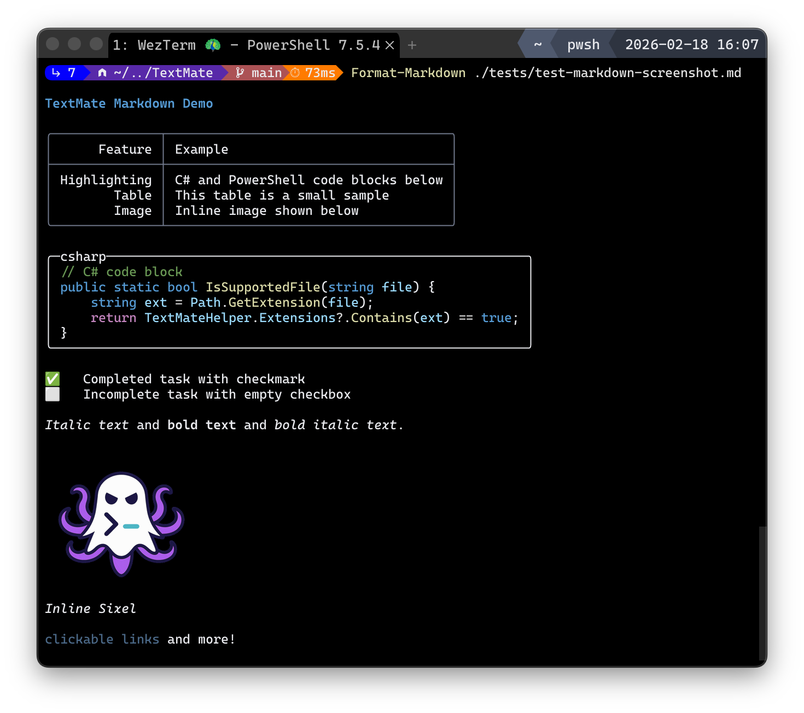

# Pager Highlight Showcase

This file is for validating search highlight behavior across different renderable shapes.
Search queries to try: `Out-Page`, `Format-Markdown`, `Panel`, `Sixel`.

## Plain Paragraph

`Out-Page` should highlight only the matching line text, not unrelated lines.

## Bullet List

- Render markdown with `Format-Markdown`.
- Pipe output to `Out-Page`.
- Validate row background is scoped to matching lines only.

## Numbered List

1. Search for `Out-Page`.
2. Press `n` repeatedly.
3. Confirm highlight stays on the expected row.

## Nested Lists with Tasks

1. First item
   - [x] Nested completed task
   - [ ] Nested incomplete task
2. Second item
   - [ ] Another nested task

## Block Quote

> The pager should highlight matches in quoted text.
> Query target: `Out-Page` appears here.

## Table

| Command          | Description                                                   |
|------------------|---------------------------------------------------------------|
| Test-TextMate    | Check support for a file, extension, or language ID.         |
| Out-Page         | Builtin terminal pager.                                       |
| Format-Markdown  | Highlight Markdown content and return a HighlightedText object. |

## Fenced Code

```powershell
Get-Content -Path '.\README.md' -Raw |
    Format-Markdown -Theme 'SolarizedLight' |
    Out-Page
```

```csharp
public class TestClass {
    public string Name { get; set; } = "Test";
    
    public void DoSomething() {
        Console.WriteLine($"Hello {Name}!");
    }
}
```

## Inline HTML Block

<div>
<p>Panel-like renderers should not tint everything when only one line matches.</p>
<p>Query target: Out-Page</p>
</div>

### Inline Sixel HTML



## Mixed Emphasis

Use **Out-Page** for paging and _Format-Markdown_ for markdown highlighting.

## Long Paragraph

When a long line wraps in the terminal, the behavior should still be stable: only the matching row (or wrapped visual line) gets row background, and the exact matched span gets match style. This sentence includes Out-Page once for verification.
